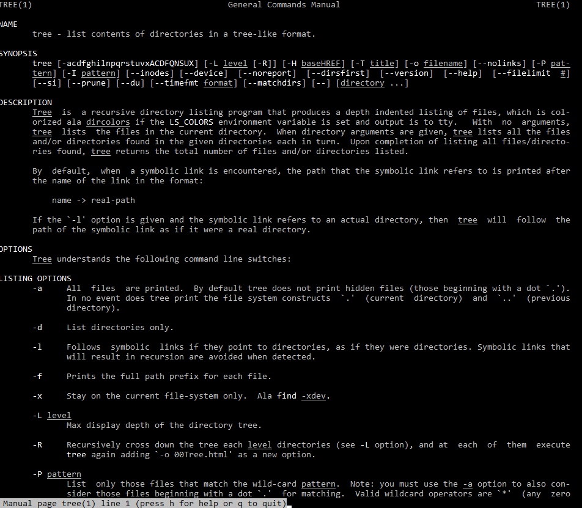

# Lab 01 Report - Introduction to Open Source Software

# Open Source Software - Spring 2021
## (( Rory Eiffe (eiffer) ))

## Bio
(( I am a senior at RPI, graduating May 2021. ))

## Discord
Rory#2873

## Photo of Me

## Discord Photo

### Reading Assignments:

## The Open Source Definition

These 10 criteria of open source are important because they all share a common goal: freedom. Every criteria listed ensures that anyone can have access to the source code and are able to use it in the least restrictive ways possible. This is important because it allows the maximum potential collaboration. Collaboration would be impeded if, for example, rule number 5 was void and not everyone would be able to work on the code. Furthermore, rule number 1 disallows financial barriers from impeding one's ability to code. In this way, the concept of open-source software allows the field of computer science to be an equalizer among all types of people. 

## How To Ask Questions The Smart Way

Tips on answering questions:

1. Even if a question is already answered, sometimes it is helpful to answer in a different way. It might help people who are coming to the forum with a slightly different question. 

2. Let the querent know when they had a good question. This will reinforce the importance and benefits of asking questions online. 

## Free Culture Chapter 3 

In this chapter, "Catalogs", we were told of a student named Jesse Jordan who created a search engine using multiple different pre-existing technologies. The Recording Industry Association of America (RIAA) ended up threatening to sue him for $15,000,000, forcing Jesse to settle and give up the $12,000 dollars that he had spent years saving up. My first impression from reading that chapter is that the RIAA is evil. They forced a college student to pay thousands of dollars for something that he accidentally did. They didn't issue a warning but instead jumped straight to suing him for millions of dollars, when the president of the RIAA already makes $1 million a year. In regards to open-source software, this chapter serves as a warning to what can happen when freedom isn't allowed on created properties. Luckily, open-source software is made accessible to anyone and people can't really be sued for using other people's open-source software. If that was the case, people would be so busy suing each other that we couldn't really produce software. The concept of open-souce software allows programmers to develop projects without fear of "stealing" other people's work, since OSS is freely available to anyone. 

### Linux

